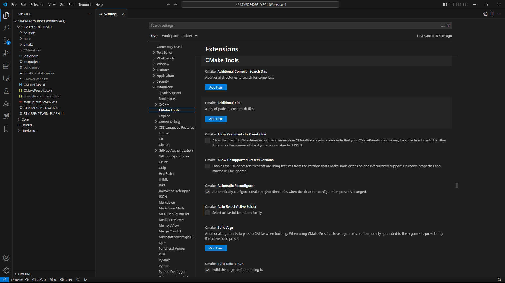

# VS Code Setup

VS Code Environment setup

## CMAKE Setting

CMAKE Setting Changes

### CMAKE Auto Select Active Folder

Disable the following option in VS Code ```CMake Tools``` setting, this disables selection of active folder for CMAKE to compile whenever the folder is changed from main folder.

 <!-- .element height=800 width=450 -->
